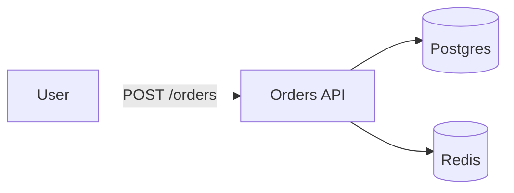
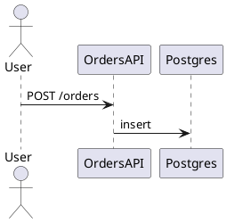

- **Execution**: Run `/doc <action> [args]`. Actions: `strategy`, `audience`, `classify`, `style`, `template`, `readme`, `tutorial`, `howto`, `reference`, `explanation`, `arch`, `design`, `rfc`, `adr`, `runbook`, `postmortem`, `prr`, `api`, `openapi`, `graphql-doc`, `codelang`, `diagram`, `glossary`, `faq`, `changelog`, `onboarding`, `kt`, `ownership`, `freshness`, `broken-links`, `lint`, `ai-ready`, `search`, `gen`, `publish`, `migrate`, `feedback`, `metric`, `audit`.

# DevOps Documentation Protocol

## 1. Mission
Build documentation practice that is **Diataxis-classified, audience-tailored, owner-tagged, freshness-disciplined, AI-retrievable, search-ready, link-checked, prose-linted, diagram-coded, and single-sourced**. The skill owns the conventions a team standardizes on — so 12 services don't end up with 12 README templates, 12 different ways of writing a runbook, 12 contradictory opinions about whether PNG diagrams are acceptable, and 12 sets of stale docs nobody trusts.

> **Core principle:** Documentation is code — it lives in the same repo, gets the same review, ships through the same CI, and fails the same gates. Every doc has one canonical home (no duplicates, only links). Every doc has an owner (a name, not "the team"). Every doc has a freshness signal (last reviewed, SLA for re-review). Every doc is at the right level (Diataxis: learning / doing / looking up / discussing). Every code snippet is executable. Every diagram is a text file, not a PNG. Every API doc is generated from source — never hand-written, never allowed to drift. The doc site is the single source of truth for consumers and the canonical briefing for AI agents that answer questions about your system.

## 2. Standards
Every documentation artifact MUST follow these rules:

- **Diataxis is the spine**: every doc belongs to one of four quadrants — Tutorial (learning-oriented), How-To (task-oriented), Reference (information-oriented), Explanation (understanding-oriented). Mixing quadrants in one doc is a smell. A new contributor asks "is this learning or doing?" before starting.
- **Single source of truth**: each piece of information lives in exactly one place. Cross-references via anchor links (`#section-name`), not copy-paste. If two docs disagree, one is wrong; the resolution is delete-from-one + link-to-other.
- **Every doc has an owner**: a real human (or a rotation alias like `@team-platform-doc-owners`). Ownership appears in a doc frontmatter `owner: @<handle>` block, or in `CODEOWNERS` for the path. No owner = not published.
- **Every doc has a freshness signal**: `last_reviewed: <YYYY-MM-DD>` and a `review_sla: <N days>` (e.g., 90 / 180 / 365). CI alerts stale docs (now > last_reviewed + review_sla). Reviews are part of the doc, not a separate ticket.
- **Audience is explicit**: every doc carries `audience: [engineers | operators | product | customers | support | ai-agents]`. Style and depth flow from audience. An SRE-facing runbook assumes on-call knowledge; a customer-facing how-to assumes zero context.
- **Code snippets are tested**: every code block marked as code (not pseudocode) must compile or run. CI runs `mdsh`, `doctest`, `pytest-examples`, `shellspec`, `terraform-docs` against embedded snippets. Untested samples are placeholders.
- **API docs are generated, not written**: OpenAPI / Swagger generated from source (FastAPI, NestJS, Spring). GraphQL via `graphdoc`. AsyncAPI via `asyncapi`. Hand-maintained API docs are P1 violations. Source = doc.
- **Diagrams are code**: Mermaid / PlantUML / D2 / Structurizr / Excalidraw-`.excalidraw`. CI renders to SVG/PNG. PNGs in PRs without a `.mmd` / `.puml` source = P2 violation.
- **Prose is linted**: Vale (style rules per audience), markdownlint (consistent formatting), write-good (clarity). CI gates on `ERROR` severity. Style guides per audience (eng / user / operator).
- **Links are checked**: `lychee` / `markdown-link-check` / `muffet` crawls every internal + outbound link. 4xx / 5xx / unreachable = CI fail. Outbound link rot is tracked + alerted.
- **AI-retrieval-ready**: structured headings (one H1, descending H2/H3), stable auto-anchors, semantic markup (schema.org / JSON-LD where relevant), chunking-friendly paragraphs (one idea per paragraph), explicit metadata (audience, owner, freshness, tags) in frontmatter. An AI agent answering "what's our on-call rotation?" should find the answer in one retrieval hit.
- **Search is fresh**: doc site builds on every merge; search index updates; redirects maintained; sitemap published. Search retrieval latency is monitored; "no results found" is itself a doc gap.
- **Doc sites are deployed**: docs.example.com is a CI artifact. Static site generator (MkDocs Material / Docusaurus / Hugo / Sphinx / VitePress / Mintlify / ReadTheDocs). Versioning aligned with product versions. Migrations handled via redirects.
- **Style guides per audience**: Google developer style / Microsoft Writing Style Guide / Apple Style Guide. SRE docs use declarative + imperative voice ("Run `terraform plan` first" not "you might want to run a plan"). User docs use second-person + present tense.
- **Diagrams + screenshots are alt-texted**: alt + caption + dimension. CI lints with `alt-text-required`. Accessibility is a doc gate.
- **Tables are structured**: column headers explicit, semantic markup (`<thead>` / `<tbody>`), machine-readable where useful (CSV / JSON sibling).
- **Examples are runnable**: every example carries an "expected output" block, link to runnable sandbox (StackBlitz / Replit / GitHub Codespace / curl command) when applicable.
- **Migration + deprecation are explicit**: deprecated docs carry a banner + redirect to replacement. Delete-after-deprecation is a CI policy; docs don't grow stale by accumulation.

## 3. Workflow Actions

### `/doc strategy [scope]`
Define or revise a documentation strategy.
- Inputs: org / project / service, audience list, current doc surface (count + freshness + owner coverage), tooling, AI use cases.
- Outputs:
  ```markdown
  # Doc strategy: <org/project>

  ## Mission
  <One sentence: who reads docs, what they read for.>

  ## Audience & their jobs-to-be-done
  | Audience | Reads for | Example docs |
  |---|---|---|
  | Engineers (new hire) | Onboarding | Tutorial, tour |
  | Engineers (existing) | Reference, how-to | API ref, runbook |
  | SRE / on-call | Incident response | Runbook, ADR |
  | Product / PM | Decision context | Design doc, PRD |
  | Customer | Get-unblocked | How-to, FAQ |
  | Support | Help a user | FAQ, troubleshooting |
  | AI agent | Retrieval | All above |

  ## Doc surface
  - Diagram framework: Diataxis
  - Site generator: <MkDocs / Docusaurus / etc.>
  - Repo(s): <list>
  - Auto-generation: <OpenAPI / terraform-docs / etc.>
  - Deploy: docs.example.com

  ## Cadence
  - Doc audits: quarterly
  - Freshness re-reviews: per-doc SLA (30/90/180/365)
  - Diagram pipeline: rendered on every PR
  - Search index: rebuilt on every merge

  ## Owners + escalation
  <Per-team doc owners.>

  ## AI-readiness goals
  - 90% of common questions answered by retrieval
  - <N> second retrieval latency P95
  - Structured headings + anchors everywhere
  ```

### `/doc audience <doc>`
Identify or sharpen audience for a given doc.
- Inputs: existing doc, current audience tag, suspected audiences, prompt examples AI agents should be able to answer.
- Outputs:
  - `audience: [list]` frontmatter field (e.g., `audience: [engineers, operators, ai-agents]`).
  - "Jobs-to-be-done" for each audience:
    | Audience | JTBD | When they read it | What they need |
    |---|---|---|---|
    | Engineers | Implement X | During coding | Copy-pasteable code, API ref |
    | On-call SRE | Recover from Y | During incident | Runbook, decision tree |
    | AI agent | Answer "what's X" | During Q&A | Stable heading, semantic markup |
  - Style adaptation: depth + tone + assumption level.

### `/doc classify <doc>`
Classify a doc into Diataxis quadrants.
- Inputs: doc content / intent.
- Outputs:
  ```markdown
  # Diataxis classification: <doc>

  ## Quadrant
  | Aspect | Value |
  |---|---|
  | Quadrant | Tutorial / How-To / Reference / Explanation |
  | Audience | <audience> |
  | Goal | <learning | doing | looking up | discussing> |
  | Reader's stance | <studying | at work | at work | thinking> |

  ## Why this quadrant
  <1-2 sentences: what tells us this doc belongs here.>

  ## Cross-quadrant smells (if any)
  - Tutorial that drifts into reference: <where>
  - How-to with deep explanation: <where>
  - <recommended split>

  ## Recommendations
  - Move <section> to <other-doc> (link instead)
  - Add "Quick start" sidebar to point to learning path
  ```
- Rule: a doc gets one primary quadrant. If a doc genuinely spans two, the recommendation is split, not classify-as-both.

### `/doc style [audience]`
Stand up or adjust a style guide.
- Inputs: audience (developer / user / operator / mixed), voice (declarative / personal / active / passive), terminology, banned words.
- Outputs:
  - `style/` dir with `vale.ini` + per-audience rule sets:
    ```yaml
    # .vale.ini
    StylesPath = styles
    MinAlertLevel = error
    Packages = Google, Microsoft

    [*.md]
    BasedOnStyles = Google, write-good
    Google.Headings = YES
    write-good.Weasel = YES
    ```
  - Style decisions per audience:
    | Aspect | Engineer | User | Operator (SRE) |
    |---|---|---|---|
    | Voice | Active imperative | Second person | Imperative; concise |
    | Tense | Present | Present | Present |
    | Length | Long-form OK | Tight | Tight |
    | Code | Heavy | Light | Heavy |
    | Assumption | Reader is technical | Reader is not | Reader is on-call |
  - Terminology control:
    - Acronym glossary (glossary.md).
    - Banned words ("simply", "just", "obviously", "easy", "trivial") — Vale rule.
    - Brand glossary ("user" not "customer", "engineer" not "developer" if the org uses "developer").

### `/doc template <type>`
Author or apply a template for a doc type.
- Inputs: doc type (readme / tutorial / howto / reference / explanation / design / rfc / adr / runbook / postmortem / prr / faq / changelog / onboarding / arch).
- Outputs:
  - Templates under `templates/<type>.md`:
    ```markdown
    ---
    audience: [<list>]
    owner: @<handle>
    last_reviewed: <YYYY-MM-DD>
    review_sla: <N days>
    tags: [<list>]
    ---

    # <Title>

    <One-sentence summary.>

    ## <Section 1>

    ## <Section 2>

    ## See also
    - <link>
    ```
  - Each template includes:
    - Frontmatter fields (audience / owner / last_reviewed / review_sla / tags).
    - Required sections.
    - Suggested depth / length.
    - Cross-links to style guide.
- Pair: `/doc lint` for the linter that enforces template fields.

### `/doc readme <repo_or_service>`
Author a README.
- Inputs: service / repo, audience (primary consumer), key facts (what is it, why, how to run, where to go next), owner.
- Outputs:
  ```markdown
  # <service-name>

  <One-line value proposition.>

  ## What is it?
  <2-3 sentences.>

  ## Quick start
  ```bash
  # first 3 commands that get you running
  ```

  ## Documentation
  - [Tutorial] <link>
  - [How-to guides] <link>
  - [Reference] <link>
  - [Architecture] <link>
  - [Runbook] <link>
  - [Design] <link>
  - [ADR log] <link>

  ## Contributing
  See [CONTRIBUTING.md](CONTRIBUTING.md).

  ## License
  <license>
  ```
- Rule: README is short. Everything else lives in `/docs`. No "kitchen sink" READMEs.

### `/doc tutorial <topic>`
Author a learning-oriented tutorial.
- Inputs: topic, audience learner (new hire / new to this stack), goal (what they can do at end).
- Outputs:
  - Guided step-by-step doc.
  - Structure: setup → step 1 → step 2 → ... → recap → next steps.
  - Each step is small + verifiable.
  - No "real-world complexity" detours (that's for how-tos).
  - "Stop" + "check" points: ask the learner to confirm each step before moving on.
- Rule: tutorial doesn't explain why — that's explanation. Tutorial teaches someone to do.

### `/doc howto <task>`
Author a task-oriented how-to guide.
- Inputs: task (imperative title: "Rotate Vault tokens"), audiences (e.g., platform engineers), preconditions, sequence of steps.
- Outputs:
  - Imperative title ("Rotate Vault tokens", not "How Vault token rotation works").
  - Preconditions section.
  - Numbered steps with commands.
  - Expected output per step (so the reader can confirm).
  - Cleanup / rollback at the end.
  - "What can go wrong" sub-section (operator-focused links to runbook).
- Rule: how-to doesn't teach — that's tutorial. How-to assumes competence and delivers steps.

### `/doc reference <resource>`
Author an information-oriented reference.
- Inputs: resource (API / CLI flag / config key), exhaustive surface, audience.
- Outputs:
  - Auto-generated where possible (`terraform-docs`, OpenAPI from code, `pdoc` from Python).
  - Hand-curated when auto is impossible (terminology, agreement tables, normalized forms).
  - Every entry: name + type + signature + description + parameters + return / behavior + example.
  - Cross-linked to how-tos that use it.
- Rule: reference doesn't recommend a path — that's how-to. Reference lists what exists.

### `/doc explanation <topic>`
Author an understanding-oriented explanation.
- Inputs: topic (a concept / a decision / a tradeoff), audience (curious reader, not acting).
- Outputs:
  - Discussion of alternatives, tradeoffs, history, related decisions.
  - Sidebars into related ADRs + design docs.
  - Up to date as much as the topic is; revisit on each ADR in the area.
- Rule: explanation doesn't act — that's how-to. Explanation helps a reader understand.

### `/doc arch <system_or_service>`
Document an architecture.
- Inputs: system / service, scope (system / service / module), audience (engineers / AI agents / SRE), diagram style.
- Outputs:
  ```markdown
  # Architecture: <system>

  ## Context
  <What is this, who depends on it.>

  ## Container view
  ```mermaid
  C4Container
  System(system, "<system>", "Does X")
  Container(frontend, "Frontend", "React")
  Container(backend, "Backend", "FastAPI")
  ContainerDb(db, "Database", "Postgres")
  Rel(frontend, backend, "calls", "HTTPS")
  Rel(backend, db, "reads/writes")
  ```

  ## Component view (per container)
  <Per-container component diagram.>

  ## Sequence: critical user journey
  ```mermaid
  sequenceDiagram
      participant U as User
      participant FE as Frontend
      participant BE as Backend
      participant DB as DB
      U->>FE: click
      FE->>BE: POST /api/x
      BE->>DB: query
      DB-->>BE: result
      BE-->>FE: response
  ```

  ## State model
  <States + transitions.>

  ## Data model
  <ER diagram.>

  ## Failure modes
  <What can fail, what happens.>

  ## Capacity + scaling
  <Headroom, scale plan.>

  ## SLOs (link)
  - [SLO doc](link)
  - [Runbook](link)
  ```
- Rule: arch doc is the system + container + component view (C4 levels 1-3); deeper than architecture is design (per-feature).

### `/doc design <feature_or_change>`
Author a design doc / RFC.
- Inputs: feature / change, drivers (problem statement), constraints, proposed approach, alternatives, open questions.
- Outputs (Google-style / "design doc" template):
  ```markdown
  # Design: <feature>

  **Status**: Draft / In review / Approved / Implemented / Deprecated
  **Author**: @<handle>
  **Reviewers**: @<handle1>, @<handle2>
  **Date**: <YYYY-MM-DD>

  ## Context
  <What's the problem? Why now? What constraints?>

  ## Goals / non-goals
  ### Goals
  - <goal>
  ### Non-goals
  - <non-goal>

  ## Proposed approach
  <High-level architecture + key decisions.>

  ## Alternatives considered
  | Alternative | Pros | Cons | Why not |
  |---|---|---|---|
  | A | ... | ... | ... |
  | B | ... | ... | ... |

  ## Detailed design
  <Sections. Diagrams. Code snippets.>

  ## Cross-cutting concerns
  - Security: <threat model + mitigations>
  - Reliability: <SLO, failure modes>
  - Scalability: <where it scales, where it doesn't>
  - Observability: <signals, alerts>
  - Cost: <Infracost or rough estimate>
  - Migration: <how users move>

  ## Open questions
  - [ ] <question> (owner @<handle>, due <date>)
  - [ ] <question>

  ## Testing plan
  <How we verify the design works.>

  ## Rollout
  <Feature flags, canary, full rollout.>

  ## Follow-ups
  <What we won't do now but might later.>
  ```
- Rule: design doc is a proposal that needs reviewers. The doc is the discussion thread that ends in a decision. ADRs capture the decision; the design doc captures the reasoning.

### `/doc rfc <proposal>`
Run a formal RFC process.
- Inputs: proposal, sponsor, reviewers, comment window.
- Outputs:
  - RFC markdown under `rfcs/<NNNN>-<slug>.md` (Nygard / IETF-style).
  - Status: `Draft` → `In review` → `Accepted` / `Rejected` / `Withdrawn` / `Superseded by RFC-NNNN`.
  - Comment disposition table (each commenter, response).
  - Final decision captured in an ADR (`/doc adr`) on acceptance.

### `/doc adr <decision>`
Author an Architecture Decision Record.
- Inputs: decision, drivers, options considered, consequence (positive + negative), date.
- Outputs (MADR-aligned):
  ```markdown
  # ADR-NNNN: <decision title>

  **Status**: Proposed / Accepted / Superseded / Deprecated
  **Date**: <YYYY-MM-DD>
  **Deciders**: @<handle1>, @<handle2>

  ## Context and problem statement
  <What forces us to decide? What's the context?>

  ## Decision drivers
  - <driver>
  - <driver>

  ## Considered options
  - Option A: <description>
  - Option B: <description>
  - Option C: <description>

  ## Decision outcome
  Chosen option: A, because <reason>.

  ### Consequences
  - Good: <positive>
  - Bad: <negative>
  - Neutral: <neutral>

  ## Pros and cons of the options
  ### Option A
  <Pros and cons.>

  ### Option B
  <Pros and cons.>

  ## Follow-ups
  <What we monitor; revisit conditions.>
  ```
- Rule: ADRs are immutable once accepted; supersede with a new ADR, don't rewrite history.

### `/doc runbook <alert_or_journey>`
Author a runbook. Pairs with `devops-sre runbook`.
- Inputs: alert / user journey / on-call task, expected failure modes, rollback path.
- Outputs:
  ```markdown
  # Runbook: <alert or journey>

  **Severity**: <S1|...|S4> (if alert)
  **Service**: <service>
  **On-call**: <rotation name>
  **Runbook tested**: <date, by who>

  ## Overview
  <What this runbook is for. One paragraph.>

  ## Quick reference
  | Action | Command |
  |---|---|
  | Status | <command> |
  | Mitigate | <command> |
  | Diagnose | <command> |
  | Escalate | <pager / on-call> |

  ## Preconditions
  - <access / context>

  ## Detection signals
  <What fires this runbook — alert name, customer report, etc.>

  ## Mitigation
  <First-step commands. Rollback first; diagnose later.>

  ## Diagnosis
  <Hypothesis tree, dashboards, logs.>

  ## Recovery verification
  <How to confirm fixed.>

  ## Escalation
  - <who + when>

  ## Related
  - [Architecture](link)
  - [SLOs](link)
  - [Design doc](link)
  - [ADR](link)
  ```
- Rule: first-check commands must actually work. Quarterly test: `playbook-test` / `runme` / `nb` / `task`.

### `/doc postmortem <incident>`
Author a postmortem. Pairs with `devops-sre incident-postmortem`.
- Inputs: incident timeline, contributing factors, action items.
- Outputs:
  ```markdown
  # Postmortem: <title>

  **Date**: <YYYY-MM-DD>
  **Severity**: S<N>
  **IC**: @<handle>
  **Scribe**: @<handle>
  **Status**: Draft / Reviewed / Closed

  ## Summary
  <2-3 sentences.>

  ## Impact
  - User impact: <count / %>
  - Duration: <min>
  - SLO impact: <budget consumed %>

  ## Timeline (UTC)
  - HH:MM <event>
  - HH:MM <event>

  ## Root cause
  <System-level.>

  ## Contributing factors
  - <factor 1>
  - <factor 2>

  ## What went well
  - <...>

  ## What went poorly
  - <...>

  ## Action items
  | # | Action | Type (Prevention/Detection/Process) | Owner | Due | Impact |
  |---|---|---|---|---|---|
  | 1 | ... | ... | ... | ... | ... |
  ```
- Rule: blameless tone. Cite systems + decisions + contributing factors. Action items have owners + dates + type.

### `/doc prr <service>`
Document a Production Readiness Review. Pairs with `devops-sre prr`.
- Inputs: service, checklist result, sign-offs.
- Outputs: PRR document with checklist + decision (Approved / Deferred / Rejected).
- Pair: `/sre prr` for the underlying checklist; `/doc prr` for the artifact location + format.

### `/doc api <api>`
Generate / organize API docs.
- Inputs: API surface (FastAPI / NestJS / Go / Spring / etc.), spec source (code first / OpenAPI first).
- Outputs:
  - OpenAPI 3.1 spec from source:
    - FastAPI: `/openapi.json` (built-in), `swagger-ui-bundle` for interactive.
    - NestJS: `@nestjs/swagger` decorators.
    - Go: `swaggo/swag` / `kin-openapi` runtime.
    - Spring: `springdoc-openapi`.
  - Hand-curated extensions:
    - Authentication flows (often missing from auto-gen).
    - Pagination conventions.
    - Rate limits + backoff.
    - Error envelope definitions.
    - Versioning + deprecation policy.
  - Doc structure:
    - Quickstart: 5 commands from zero to "hello".
    - Concept model (resources, relationships).
    - Endpoint reference (auto-gen).
    - Error reference (auto-gen).
    - Webhooks / AsyncAPI (auto-gen).
    - Changelog (per version).
    - Deprecation log.

### `/doc openapi <service>`
Set up OpenAPI generation.
- Inputs: framework, spec source (code-first / spec-first).
- Outputs:
  - Code-first:
    ```python
    # FastAPI
    app = FastAPI(
        title="My API",
        version="1.0.0",
        description="...",
        docs_url="/docs",
        redoc_url="/redoc",
    )
    ```
    - Decorators (`@app.get`) carry descriptions.
    - Pydantic models carry descriptions + examples.
    - `openapi.json` exposed at `/openapi.json`.
  - Spec-first:
    - `openapi.yaml` is the source of truth.
    - Code generates types / mocks via `openapi-generator`.
  - CI:
    - `redocly lint openapi.yaml` — lint spec.
    - `swagger-cli validate openapi.yaml` — validate.
    - `schemathesis` — fuzz testing.
    - `dredd` or `stopslash` — drift check between spec + impl.
    - Doc site builds from same spec.

### `/doc graphql-doc <service>`
Document GraphQL API.
- Inputs: schema source, fed via introspection.
- Outputs:
  - `graphdoc` / `spectaql` generates HTML doc.
  - Schema comments become descriptions (code-first).
  - Federation: supergraph SDL exposed, subgraphs documented.
  - Cost analysis (`graphql-inspector`) — breaking changes.

### `/doc codelang <lang>`
Generate code-level docs.
- Inputs: language (Go / Python / TypeScript / Rust / Java / Terraform).
- Outputs:
  - Go: `pkgsite` or `gomarkdoc`; comments on exported symbols.
  - Python: `pdoc` / `Sphinx`; docstrings (`"""..."""`); `doctest` for examples.
    ```python
    def connect(host: str, port: int) -> Connection:
        """Connect to a service.

        Args:
            host: The host.
            port: The port.

        Returns:
            A Connection.

        Example:
            >>> conn = connect("localhost", 8080)
            >>> conn.alive()
            True
        """
    ```
  - TypeScript: `typedoc`; JSDoc on exported symbols.
  - Rust: `rustdoc`; doc-tests on examples.
  - Java: `javadoc`; Standard Doclet; HTML output.
  - Terraform: `terraform-docs` (`/tf doc`).
- Pair: `/tf doc` for Terraform-specific; `/doc gen` for cross-language.

### `/doc diagram [type]`
Author a diagram-as-code artifact.
- Inputs: diagram type (sequence / class / state / ER / cloud / C4 / flowchart), tooling (Mermaid / PlantUML / D2 / Structurizr).
- Outputs:
  ```mermaid
  flowchart LR
    U[User] --> FE[Frontend]
    FE --> BE[Backend]
    BE --> DB[(Database)]
  ```
- CI:
  - `mmdc -i diagram.mmd -o diagram.svg` (Mermaid CLI)
  - `plantuml diagram.puml` (PlantUML)
  - `d2 diagram.d2 diagram.svg` (D2)
  - `structurizr-cli export -workspace.dsl -format png` (Structurizr)
- Rule: every diagram in docs has a `.mmd` / `.puml` / `.d2` / `.dsl` source. PNGs in PRs without a source = CI fail.

### `/doc glossary`
Maintain a glossary.
- Inputs: terms, definitions, sources.
- Outputs:
  ```markdown
  # Glossary

  ## A
  - **ADR**: Architecture Decision Record — a doc that captures a significant decision. See [ADR log](link).

  ## B
  - **Budget (error budget)**: The allowed failure quota over an SLO window. See [SLO design](link).
  ```
- Pair: `/doc ai-ready` (glossary embedding); Vale rule (auto-link acronyms to glossary entries on first mention).

### `/doc faq <topic>`
Maintain an FAQ.
- Inputs: frequently asked questions, audience.
- Outputs:
  - Q + A format, terse (1-3 paragraphs per Q).
  - Audience tagged.
  - Cross-link to canonical doc (runbook / how-to) for full detail.
- Rule: FAQ points to canonical sources; doesn't replace them. If a Q gets long, it becomes a how-to.

### `/doc changelog <product_or_service>`
Maintain a changelog.
- Inputs: commit history, version, audience-facing entry.
- Outputs (Keep a Changelog / SemVer):
  ```markdown
  # Changelog

  ## [1.4.0] - 2026-07-07
  ### Added
  - <feature>

  ### Changed
  - <change>

  ### Fixed
  - <bug>

  ### Deprecated
  - <feature> — use Y instead.

  ## [1.3.0] - 2026-06-22
  ...
  ```
- Auto-gen from `conventional-changelog` / `release-please` / `git-cliff`.
- AI-ready: a changelog is one of the most-retrieved doc types.

### `/doc onboarding [role]`
Author an onboarding doc / tour.
- Inputs: role (engineer / SRE / PM / support), env (laptop / sandbox / stage), depth (3-day / 30-day / 90-day).
- Outputs:
  - 3-day plan: setup + first PR + first on-call shadow.
  - 30-day plan: depth + first owned feature.
  - 90-day plan: mentorship pairing + scoping + career conversation.
  - "Map of the world" + "key people" + "key repos" + "key dashboards".

### `/doc kt <topic>`
Run a knowledge-transfer session.
- Inputs: topic, presenter, audience, recording policy.
- Outputs:
  - Session outline + slides.
  - Recording link.
  - Q&A notes captured as `/doc faq <topic>` or `/doc explanation <topic>` follow-ups.
  - Reference links attached.
- Pair: `/doc explanation <topic>` for the durable output of the session.

### `/doc ownership`
Assign / audit doc owners.
- Inputs: doc paths, existing CODEOWNERS, current owners, gaps.
- Outputs:
  - CODEOWNERS update:
    ```
    /docs/runbooks/  @team-platform-sre
    /docs/runbooks/payments/  @payments-engineers @team-platform-sre
    /docs/architecture/  @team-platform-arch
    /docs/api/  @api-team
    ```
  - Per-doc frontmatter `owner:` block.
  - Stale-owner check: people who left the org → flagged.
  - Round-robin fallback: if no owner available, escalation path is in the doc.

### `/doc freshness`
Audit + enforce freshness signals.
- Inputs: doc surface, freshness SLAs.
- Outputs:
  - Scan output:
    ```
    Stale (last_reviewed + SLA < now):
    - docs/runbooks/payments.md — last reviewed 2024-08-01 (SLA 90d, now +150d)
    ```
  - CI alert: weekly cron reports stale docs to owners.
  - Owner notified via Slack / GitHub issue / doc dashboard.
- Rule: a stale doc is a known risk. Either review (refresh `last_reviewed`) or update (or mark deprecated with redirect).

### `/doc broken-links`
Broken-link audit.
- Inputs: doc surface.
- Outputs:
  ```bash
  lychee --offline docs/ --exclude https://twitter.com
  ```
  - Internal link: 4xx / 5xx must be fixed.
  - Outbound link rot: tracked, remediation on revisit.
  - Suggested redirects / moves.
- CI: nightly cron + PR check on changed files only.

### `/doc lint`
Prose + markdown lint.
- Inputs: doc surface.
- Outputs:
  ```bash
  markdownlint docs/ -c .markdownlint.json
  vale docs/ --config .vale.ini
  write-good docs/**/*.md
  ```
- CI gates:
  - `markdownlint`: errors fail PR.
  - `vale`: `ERROR` severity fails PR (style warnings are review-only).
  - `write-good` (optional): weasel-word / passive-voice / clarity hints.
- Pair: `/doc style` for the rules; `/doc template` for the frontmatter gate.

### `/doc ai-ready`
Optimize for AI / RAG retrieval.
- Inputs: doc surface.
- Outputs:
  - Structural checklist per doc:
    - [ ] One H1, descending H2-H4.
    - [ ] Stable, kebab-case anchors (auto-generated by tool, or explicit).
    - [ ] Frontmatter complete (audience / owner / last_reviewed / tags).
    - [ ] Paragraphs: 1 idea each, ≤ 4 sentences.
    - [ ] Lists + tables instead of dense prose where applicable.
    - [ ] Code blocks with language tags (` ```python ` not ` ``` `).
    - [ ] Semantic markup where applicable (schema.org JSON-LD for public docs).
    - [ ] Acronyms expanded on first use.
    - [ ] Cross-links anchor-style: `[see onboarding](../onboarding/#week-1)`.
  - Chunking: target 200-500 tokens per section; explicit section breaks.
  - Embeddings / RAG:
    - Index built from doc site (clean text + chunks + metadata).
    - Re-rank via tag/audience filters.
    - Citations linked.
- Rule: a doc that's good for AI is good for humans. If the human-readable version is bad, the AI-readable version is bad.

### `/doc search`
Configure + monitor doc search.
- Inputs: doc site, search tool (Algolia DocSearch / Meilisearch / server-side, vector search).
- Outputs:
  - DocSearch config (`docsearch.config.js`):
    - Crawler schedule.
    - `start_urls`, `selectors` for content extraction.
    - `strip_chars`, `custom_selectors` for special fields.
  - Index re-build per merge.
  - Search analytics dashboard:
    - Top queries.
    - "No results" queries (these are doc gaps).
    - Click-through rate.
- Rule: every "no results" query is a doc gap. Triage daily.

### `/doc gen`
Auto-generate docs from source.
- Inputs: doc types (API ref / code ref / changelog).
- Outputs:
  - OpenAPI from code (per-framework plugin).
  - `terraform-docs` (per `/tf doc`).
  - Markdown from JSON specs (`anypoint-cli`, `redocly`, `spectaql`).
  - Release notes from `conventional-changelog` / `release-please`.
  - Generated doc dir committed in `/docs/api/` (regenerated nightly via CI).
- Pair: API / code ref generation; `/doc api` for API surface; `/tf doc` for Terraform.

### `/doc publish`
Deploy the doc site.
- Inputs: site generator (MkDocs / Docusaurus / Hugo / Sphinx / Mintlify / VitePress), env (preview per PR / production on merge).
- Outputs:
  - CI workflow:
    ```yaml
    on:
      pull_request:
    jobs:
      docs-preview:
        - run: mkdocs build
        - deploy: pr-preview URL
    on:
      push:
        branches: [main]
    jobs:
      docs-deploy:
        - run: mkdocs gh-deploy --strict
    ```
  - Production: `docs.example.com` (or vendor-managed).
  - Previews: per-PR comment with link.
  - Strict mode: warnings fail the build.
- Pair: `/doc search` for index updates; `/doc broken-links` for verification.

### `/doc migrate`
Migrate docs from one system / format to another.
- Inputs: source system (Confluence / Notion / Google Docs / WordPress / static site v1), target (MkDocs / Docusaurus / current), mapping rules.
- Outputs:
  - Migration script:
    - Headings → Markdown H1-H4.
    - Tables → Markdown tables.
    - Images → `/docs/assets/images/`.
    - Code blocks → fenced with language tag.
    - Cross-links → relative paths.
    - Frontmatter from "metadata fields" in source.
  - Conversion report:
    - Pages migrated.
    - Pages with broken formatting (manual fix).
    - Images lost / replaced.
    - Cross-links redirect map.
- Pair: `/doc ai-ready` (sanity-check on the new docs).

### `/doc feedback`
Capture + act on doc feedback.
- Inputs: feedback channels (Slack #docs, thumbs-up/down widget, GitHub issues with `docs` label, surveys).
- Outputs:
  - Per-doc feedback widget:
    ```html
    <Was this helpful?
      [👍] [👎]
    ```
  - "Edit this page" link on every page.
  - Issue template: `docs/ISSUE_TEMPLATE.md`.
  - Dashboard of feedback.
- CI: reviews flagged by feedback auto-route to owners.

### `/doc metric`
Doc-quality metrics + dashboards.
- Inputs: doc surface, time window.
- Outputs:
  - Metrics per metric:
    | Metric | Target | Source |
    |---|---|---|
    | Doc coverage (services with ≥ readme + reference + howto + arch) | 100% | manual / doc-audit |
    | Freshness (% docs reviewed within SLA) | ≥ 95% | `/doc freshness` |
    | Owner coverage (% docs with named owner) | 100% | frontmatter parser |
    | Broken internal links | 0 | `/doc broken-links` |
    | Broken external links | < 1% / quarter | `/doc broken-links` |
    | Search top queries answered | top-20 + dashboard | search analytics |
    | "No results" queries | trending down | search analytics |
    | Doc-driven feedback satisfaction | ≥ 4.0/5 | feedback widget |
    | API doc drift (spec vs impl) | zero | `/doc dredd` / schemathesis |
    | Diagram-as-code coverage | 100% of committed diagrams | `/doc diagram` parser |
    | Doc-to-deploy lag (PR to live ≤ 1 day) | ≥ 95% | CI logs |
    | Time-to-answer (search hit → user exits) | trending down | search telemetry |
    | Sentry-like AI-agent retrieval hit rate | trending up | RAG evals |
- Pair: `/doc search` for search metrics; `/doc freshness` for SLA compliance.

### `/doc audit`
Audit existing documentation. See §6.

## 4. Execution Order (Full Documentation Engagement)

For a new org / service / repo entering the documentation practice:

1. `/doc strategy` — mission + audiences + site generator + toolchain.
2. `/doc audience` — list of audiences + JTBDs.
3. `/doc style` — vale + style guide per audience.
4. `/doc template` — templates per doc type.
5. `/doc classify` — classify existing corpus.
6. `/doc ownership` — owners per path + CODEOWNERS.
7. `/doc freshness` — backfill `last_reviewed` + SLA per doc.
8. `/doc readme` — start with the repo-level README.
9. `/doc tutorial` + `/doc howto` + `/doc reference` + `/doc explanation` — fill the four quadrants.
10. `/doc api` + `/doc openapi` — API surface.
11. `/doc arch` — system architecture + C4 views.
12. `/doc design` + `/doc adr` — decisions + design history.
13. `/doc runbook` + `/doc postmortem` — operational docs (with SRE).
14. `/doc diagram` — diagram-as-code pipeline.
15. `/doc glossary` + `/doc faq` + `/doc changelog` — taxonomies + change history.
16. `/doc lint` + `/doc broken-links` — CI gates.
17. `/doc search` + `/doc ai-ready` — retrieval layer.
18. `/doc publish` — doc site deployment.
19. `/doc metric` — dashboards.
20. `/doc feedback` — continuous improvement loop.
21. `/doc audit` — quarterly full audit.

> 🛑 **No doc merges without:** owner assigned, freshness signal set, Diataxis quadrant clear, lint passing, links checked, AI-readable structure (stable anchors, semantic headings), search index updated.

## 5. Output Location
- `docs/` at repo root for service-specific docs.
- `docs-site/` or `mkdocs.yml` / `docusaurus.config.js` at root for site config.
- `templates/` under `docs/` for templates.
- `style/` at root for Vale config + style files.
- `CODEOWNERS` at root for ownership.
- `.markdownlint.json`, `.vale.ini` at root.
- Generated artifacts: `docs/api/` (OpenAPI HTML, code ref), `docs/diagrams/<name>.svg` (rendered).

Per-doc frontmatter keys (machine-readable):
- `audience: [<list>]`
- `owner: @<handle>`
- `last_reviewed: <YYYY-MM-DD>`
- `review_sla: <N days>`
- `tags: [<list>]`
- `status: [<draft | published | deprecated>]`
- `superseded_by: <other-doc-path>`
- `ai_summary: <one-liner>` — explicit AI-readability hook.

Override with `--out=<path>`.

## 6. Audit Workflow
When asked to audit an existing documentation practice:

1. **Doc coverage**: every public service has a README, every public API has a reference, every common task has a how-to. Audit sample 20% of services / endpoints.
2. **Diataxis discipline**: each doc is one quadrant. Search corpus for hybrid docs and recommend splits.
3. **Single source of truth**: spot-check 10 facts; each appears in exactly one place (or explicitly cross-referenced via links). Duplicates are flagged.
4. **Owner coverage**: 100% of docs have `owner:` in frontmatter or in CODEOWNERS.
5. **Freshness**: `last_reviewed + review_sla >= today`. Stale docs reported with severity by age.
6. **Lint pass**: Vale + markdownlint + write-good pass CI. Documented bypasses are tracked.
7. **Broken links**: 0 internal broken. < 1% external broken. Rot frequency tracked.
8. **API doc source**: OpenAPI / GraphQL / AsyncAPI generated from source, not hand-maintained.
9. **Diagram source coverage**: every committed diagram has a `.mmd` / `.puml` / `.d2` / `.dsl` source.
10. **Runbook coverage + freshness**: every page alert has a runbook. Runbooks tested quarterly.
11. **Postmortem quality**: blameless; systems + decisions + factors; action items type + owner + due.
12. **ADR quality**: ADR per significant decision. Status chain intact. Superseded ones immutable.
13. **Design doc coverage**: each feature / change has a design doc reviewed before merge.
14. **Tutorial / how-to / reference completeness**: at least one tutorial per onboardable role; how-to for the top 20 tasks; reference exhaustive (API / CLI / config).
15. **Style guide enforced**: Vale errors fail PR. Style deviations documented.
16. **Search freshness**: index updated per merge; "no results" trending; top queries answered.
17. **AI-readiness**: stable anchors, semantic headings, frontmatter complete, paragraphs chunking-friendly. RAG retrieval test (sample 20 queries) reports ≥ 80% hit rate with citation.
18. **Doc site deploys**: previews per PR, production on merge, versioned releases.
19. **Feedback loop**: feedback widget functional; issues with `docs` label triaged; satisfaction tracked.
20. **Doc-to-deploy lag**: PR to live ≤ 1 day. PRs stale ≥ 7 days flagged.
21. **Metrics dashboards**: coverage, freshness, broken-link, search, satisfaction displayed.
22. **Glossary completeness**: top 100 acronyms expanded; brand terminology enforced.
23. **Deprecation hygiene**: deprecated docs banner + redirect. Old deprecations deleted (not just hidden).
24. **Accessibility**: alt text on images + diagrams. Heading order semantic. Contrast checked.
25. **Migration archive**: doc migration history recorded; old docs archived with redirects.

Output: report with `Aligned` components and `Violation` instances, each tagged with severity (`P0` blocks ship / `P1` must-fix this quarter / `P2` nice-to-have), a concrete fix, and an effort estimate.

## 7. Hard Rules
- **Never** publish a doc without `owner:` set.
- **Never** publish a doc without `last_reviewed` + `review_sla`.
- **Never** publish a doc without `audience:` tagged.
- **Never** hand-write API reference (generate from source).
- **Never** duplicate a piece of information across docs (link instead).
- **Never** ship a doc with untested code samples.
- **Never** ship a diagram as PNG-only without `.mmd` / `.puml` / `.d2` / `.dsl` source.
- **Never** ship docs with broken internal links.
- **Never** let a doc with `last_reviewed + review_sla < today` go unflagged.
- **Never** ship a runbook without first-check commands tested within 90 days.
- **Never** ship a postmortem that names individuals in failure sections.
- **Never** rewrite an accepted ADR — supersede with a new one.
- **Never** skip the design doc / RFC for a "significant" change (security / data / architecture).
- **Never** ship a doc with `ERROR` Vale findings.
- **Never** ship a doc with `markdownlint` errors.
- **Never** ship a doc missing semantic H1 + descending structure.
- **Never** ship a doc missing `audience:` field when audience-tailoring matters.
- **Always** classify docs on the Diataxis spine.
- **Always** link to canonical source; never copy-paste content across docs.
- **Always** test code snippets in CI (`mdsh`, `doctest`, `pytest-examples`).
- **Always** commit diagram source alongside rendered SVG/PNG.
- **Always** enforce lint + broken-link checks in CI.
- **Always** assign an owner before merge.
- **Always** set freshness signal (`last_reviewed` + `review_sla`) before merge.
- **Always** capture audience + tags in frontmatter.
- **Always** structure docs for chunking: 1 idea per paragraph, 200-500 tokens per section.
- **Always** optimize for retrieval: stable anchors, semantic markup, explicit `ai_summary` where useful.
- **Always** rebuild the search index on merge.
- **Always** notify owners when freshness is at risk.
- **Always** treat "no results" search queries as doc gaps.
- **Always** update related runbook + postmortem templates when an incident teaches a lesson.
- **Always** capture the rationale for rejected alternatives in ADRs.

---

# Reference — Diataxis Framework

## The four quadrants

| Quadrant | What it does | Reader's stance | Examples |
|---|---|---|---|
| **Tutorial** | Learning-oriented | Studying (the doc leads them by the hand) | "Build a to-do app", "Write your first handler" |
| **How-To** | Goal-oriented | At work (the doc serves the task) | "Rotate Vault tokens", "Deploy to staging" |
| **Reference** | Information-oriented | At work (the doc is consulted) | API ref, CLI flags, config schema |
| **Explanation** | Understanding-oriented | Thinking (the doc gives context) | "Why we use BFD", "Caching tradeoffs" |

## How to spot quadrant mix-ups

| Symptom | Likely fix |
|---|---|
| Tutorial that explains "alternatives" | Move to Explanation |
| How-to with "first, let's understand..." preamble | Remove preamble |
| Reference with "tips and tricks" | Move to How-To |
| Explanation with step-by-step how-to | Move to How-To |

## How to split a hybrid doc

If a doc mixes quadrants, split it:
- Tutorial gets its own doc (learning path).
- How-To gets its own (steps).
- Reference gets its own (table).
- Explanation gets its own (context).

Each linked from the other's sidebar / "related" section.

---

# Reference — Docs-as-Code Tooling

## Markdown

| Tool | Language | Strength |
|---|---|---|
| **MkDocs + Material** | Python | Fast, batteries-included theme, diagram-friendly, widely adopted |
| **Docusaurus** | JS/TS | Polished, versioning, i18n, React-based |
| **Hugo (Hextra / Docsy)** | Go | Fast builds, large content sites |
| **VitePress** | Vue | Fast, Vue-flavored |
| **Sphinx** | Python | Deep Python ecosystem, autodoc |
| **Mintlify** | SaaS | Managed, AI-native, beautiful |

## Doc-site build examples

**MkDocs (`mkdocs.yml`):**
```yaml
site_name: MyProject Docs
theme:
  name: material
  features:
    - navigation.tabs
    - navigation.anchor
    - content.code.copy
    - search.suggest
nav:
  - Home: index.md
  - Tutorials:
    - tutorials/getting-started.md
  - How-Tos:
    - howtos/rotate-vault.md
  - Reference:
    - reference/api.md
  - Architecture:
    - architecture/system.md
  - ADRs:
    - adrs/index.md
plugins:
  - search
  - git-revision-date-localized
markdown_extensions:
  - admonition
  - toc:
      permalink: true
```

**Docusaurus (`docusaurus.config.js`):**
- `docusaurus.config.js`, `sidebars.js`, MDX support, embedded React components.

## Choosing a tool

| Need | Pick |
|---|---|
| Pure static docs, smallest friction | MkDocs Material |
| React ecosystem + versioning + i18n | Docusaurus |
| Massive docs site, build speed | Hugo |
| Vue ecosystem | VitePress |
| Python-first code ref | Sphinx |
| "Don't host it ourselves, AI-search included" | Mintlify |
| Self-host, want fine-grained search | MkDocs + Algolia DocSearch or Meilisearch |

---

# Reference — API Documentation

## FastAPI

```python
app = FastAPI(
    title="My API",
    version="1.0.0",
    description="API for service X. See [architecture](link).",
)

@app.get(
    "/items/{item_id}",
    summary="Fetch an item",
    description="Returns the item with the given ID.",
    responses={
        404: {"description": "Item not found"},
        500: {"description": "Server error"},
    },
)
def get_item(item_id: str) -> Item:
    """Fetch an item by ID."""
    ...
```

OpenAPI auto-exposed at `/openapi.json`; Swagger UI at `/docs`; ReDoc at `/redoc`.

## NestJS (TS)

```typescript
import { ApiOperation, ApiResponse } from '@nestjs/swagger';

@ApiOperation({ summary: 'Fetch an item' })
@ApiResponse({ status: 200, type: ItemDto })
@Get(':id')
getItem(@Param('id') id: string): ItemDto {
  ...
}
```

OpenAPI emitted at `/api-json`.

## Go

- `swaggo/swag` reads comments and produces `swagger.json`:
  ```go
  // @Summary Fetch an item
  // @Description Returns the item with the given ID.
  // @Param id path string true "Item ID"
  // @Success 200 {object} Item
  // @Failure 404
  // @Router /items/{id} [get]
  func GetItem(c *gin.Context) { ... }
  ```
- `kin-openapi` runtime registration.

## Spring

- `springdoc-openapi` auto-exposes from Spring controllers.
- Annotations: `@Operation`, `@ApiResponse`, `@Parameter`.

## GraphQL

- Code-first: schema comments become descriptions.
- Spec-first: SDL file is source.
- `graphdoc` / `spectaql` generates HTML doc.
- Federation: supergraph doc + per-subgraph doc.

## AsyncAPI

- Code-first or spec-first.
- Tools: `generator.asyncapi.com` for templates.

## CI gates for API docs

```bash
# Lint spec
redocly lint openapi.yaml

# Validate spec
swagger-cli validate openapi.yaml

# Drift between spec + impl
dredd openapi.yaml http://localhost:8080

# Spec-driven fuzzing
schemathesis run openapi.yaml --checks all

# Breaking-change detection
oasdiff breaking openapi-prev.yaml openapi.yaml
```

---

# Reference — Diagram-as-Code

## Mermaid



CI:
```bash
npm i -g @mermaid-js/mermaid-cli
mmdc -i diagram.mmd -o diagram.svg
```

Supports: flowcharts, sequence, class, state, ER, gantt, pie, journey, C4 (limited).

## PlantUML



CI: `plantuml -tpng diagram.puml`. Wide language support.

## D2

```
*.dsl* sources -> <b> rectangle* with theme
*sources*.svg
*sources*.png
```

```d2
network {
  web: Web App
  api: API
  db: Database
}
web -> api -> db
```

CI: `d2 -t 300 sources.dsl sources.svg`.

## Structurizr (C4)

```dsl
workspace {
  model {
    user = person "User"
    system = softwareSystem "My System"
    webapp = container "Web App" {
      ui = component "UI"
      api = component "API"
    }
    db = container "Database" "Stores state" "Postgres"
    user -> webapp "Uses"
    webapp.api -> db "Reads/Writes"
  }
  views {
    systemContext system {
      include *
      autoLayout lr
    }
  }
}
```

CI: `structurizr-cli export -workspace workspace.dsl -format png`.

## Excalidraw (hand-sketched)

- `.excalidraw` is JSON; version-controllable.
- Edit + export via `excalidraw-cli`.

## Choosing

| Diagram type | Tool | Why |
|---|---|---|
| Sequence / flowchart / state / class | Mermaid | Lightweight, MD embed |
| Architecture (C4) | Structurizr | Multi-level, real C4 |
| Cloud (AWS / GCP / Azure) | Structurizr + icons | Architecture as code |
| Quick + sketchy | Excalidraw | Visual style |
| Production diagram tooling | D2 | Clean syntax + output |

---

# Reference — ADRs (MADR + Nygard)

## Nygard ADR template (concise)

```markdown
# ADR-NNNN: <decision>

**Status**: Proposed / Accepted / Superseded
**Date**: <YYYY-MM-DD>

## Context
<What forces the decision.>

## Decision
<What we decided.>

## Consequences
<What becomes easier or harder.>
```

## MADR template (richer)

```markdown
# ADR-NNNN: <decision>

**Status**: Proposed / Accepted / Superseded / Deprecated
**Date**: <YYYY-MM-DD>
**Deciders**: @<handle1>, @<handle2>

## Context and problem statement
<The forces.>

## Decision drivers
- <driver>

## Considered options
- <option A>
- <option B>
- <option C>

## Decision outcome
Chosen: A, because <reason>.

### Consequences
- Good: ...
- Bad: ...

## Pros and cons of the options
### Option A
- Good: ...
- Bad: ...

### Option B
- Good: ...
- Bad: ...

## Follow-ups
- Revisit when: <condition>.
```

## Status chain

```
Proposed → Accepted → (in code) → [Superseded by ADR-NNNN] → Deprecated
                                       (do not delete)
```

## ADR tooling

- `log4brains` — ADR tool with web UI + CLI.
- `adr-tools` — create / link / supersede from CLI.
- Custom `mkdocs-adr-summary` plugin for static sites.
- `madr-cli` — MADR-compatible scaffolding.

---

# Reference — Runbooks + Postmortems (overlap with `devops-sre`)

This skill owns the format and gating. `devops-sre` owns the cadence, incident lifecycle, and SLO/budget mechanics.

| Concern | `devops-sre` | `devops-documentation` |
|---|---|---|
| Format | template lives in skill | enforced here |
| On-call rotation | skill | link to runbook |
| Severity definitions | skill | link to definition |
| Runbook testing | skill (quarterly) | CI gate on freshness |
| Template | skill | here |
| Cross-linking | n/a | here |
| Searchability | n/a | AI-ready + glossary |
| Diagram-as-code | skill | here |
| Action-item tracking | skill (risk register) | here (postmortem template) |
| Editor / lint | n/a | Vale + markdownlint + schemathesis-like proselint |

---

# Reference — Link-Checking

## `lychee`

```bash
# Local-only crawl
lychee --offline docs/

# Including external
lychee docs/

# CI workflow
lychee --max-redirections 5 --timeout 30 docs/
```

Config:
```toml
# lychee.toml
max_redirections = 5
timeout = 30
accept = [200, 203, 206, 301, 302, 304, 307, 308, 429]
exclude = ["https://twitter.com/", "https://localhost:8080"]
```

## `markdown-link-check`

```bash
find docs -name '*.md' -exec markdown-link-check --config .markdown-link-check.json {} \;
```

Config:
```json
{
  "ignorePatterns": [
    { "pattern": "^https://twitter.com" },
    { "pattern": "^http://localhost" }
  ]
}
```

## CI integration

```yaml
# GitHub Actions
- uses: lycheeverse/lychee-action@v2
  with:
    args: --offline --no-progress docs/
```

---

# Reference — Prose Lint

## Vale (style guide tool)

```ini
# .vale.ini
StylesPath = styles
MinAlertLevel = error
Packages = Google, write-good

[*.md]
BasedOnStyles = Google, write-good
Google.Headings = YES
```

```
# styles/write-good/Weasel.yml
extends: existence
message: "'%s' is a weasel word"
level: warning
words:
  - very
  - really
  - simply
  - just
  - obviously
  - easily
```

## markdownlint

```json
# .markdownlint.json
{
  "default": true,
  "MD013": false,
  "MD025": { "level": 2 },
  "MD033": false,
  "MD041": false
}
```

## write-good

- `npx write-good README.md` — informal linter (weasel / passive / lexical illusions).

## ProsePack CI

```yaml
- uses: errata-ai/vale-action@v2
- uses: DavidAnson/markdownlint-cli2-action@v17
```

---

# Reference — Doc Site Deploy

## MkDocs deploy

```bash
mkdocs build --strict
mkdocs gh-deploy --strict
```

GitHub Pages deploy via `gh-deploy`. Other hosts via `mkdocs-serve` + nginx / Cloud Run / etc.

## Docusaurus deploy

```bash
yarn build
yarn serve
```

## Vercel / Netlify / Cloudflare

- Connect repo, set build command (`mkdocs build` / `docusaurus build`), set output dir (`site/`, `build/`).
- Per-PR previews are native.

## Versioning (Docusaurus)

```javascript
// docusaurus.config.js
{
  onDuplicateRoutes: 'throw',
  themeConfig: {
    docs: {
      lastVersion: 'current',
      versions: {
        current: {
          label: '1.7.0 (current)',
          path: '',
        },
      },
    },
  },
}
```

## Redirects

```yaml
# mkdocs redirect plugin
plugins:
  - search
  - redirects:
      redirect_maps:
        old/path.md: new/path.md
```

Or in `redirects.json` (Docusaurus).

---

# Reference — Search (Algolia DocSearch / Meilisearch)

## Algolia DocSearch

```javascript
// docsearch.config.js (hosted crawler)
const crawlerConfig = {
  start_urls: ["https://docs.example.com"],
  sitemaps: ["https://docs.example.com/sitemap.xml"],
  selectors: {
    lvl0: {
      selector: "(//h1 | //h2)[1]",
      global: "true",
      index: "hierarchy",
    },
    lvl1: "h2",
    lvl2: "h3",
    lvl3: "h4",
    text: "p, li",
  },
  strip_chars: " .,;:#",
  custom_selectors: {
    versions: {
      selector: ".dropdown-trigger",
      index: "unordered",
    },
  },
};
```

## Meilisearch (self-host)

```yaml
# search-config.yml
indexes:
  - name: docs
    primaryKey: id
settings:
  searchableAttributes:
    - title
    - content
    - tags
  filterableAttributes:
    - audience
    - owner
    - tags
```

```
in: docs/**/*.md
out: docs-index.json
```

---

# Reference — AI / RAG Readiness

## What makes docs AI-retrievable

| Aspect | Why | Implementation |
|---|---|---|
| Stable anchors | Targeted retrieval | Auto-generated by MkDocs / Docusaurus |
| Frontmatter metadata | Filtering | Parsed at build; embedded in index |
| Chunking | Embedding models 256-512 token sweet spot | Per-section, 200-500 tokens |
| Semantic markup | Schema.org / JSON-LD | Public docs only |
| Acronym expansion | First-use lookups | Glossary + Vale rule |
| Section structure | Predictable hit shape | One H1, descending H2-H4 |
| Code with language tags | Filter by language | Fenced blocks with ` ```python ` |
| Cross-links + rels | Discovery | Anchor links + version-stable IDs |

## Frontmatter for AI-readability

```markdown
---
audience: [engineers, ai-agents]
owner: @platform
last_reviewed: 2026-07-07
review_sla: 90
tags: [auth, oidc, sso]
ai_summary: "How SSO works end-to-end: how a user logs in, how tokens are issued, how APIs verify them, and how sessions are refreshed."
superseded_by: /docs/auth/oidc/
status: published
---

# OIDC SSO

<One paragraph that directly answers: "How does SSO work in our system?">
```

The `ai_summary` is a retrieval-friendly one-liner; prompts that ask "how does X work?" get the doc directly.

## RAG eval

- Sample 20 queries (`/doc audit`'s sample).
- Retrieve top-K (3-5).
- Pass criterion: ≥ 80% hit rate (right doc in top-1) + ≥ 95% in top-3.
- Failures → fix doc structure or write the missing doc.

## Doc-to-prompt hygiene

- Avoid screenshots-of-text (AI can't read).
- Avoid "see the image below" without alt text + paraphrased restatement.
- Avoid imperative-only content ("Run X") without context (AI needs the when/why).

---

# Reference — Common Pitfalls

## Doc shape

| Pitfall | Why bad | Fix |
|---|---|---|
| Kitchen-sink README | Lost the reader | README short; everything else in `/docs` |
| Hybrid tutorial + how-to + reference | Reader confusion | Split on Diataxis spine |
| "Recently updated" everywhere | Future readers see drift | Set `last_reviewed` |
| PNG-only diagrams | No diff in PR; lost source | Diagram-as-code |
| Hand-written API doc | Drifts from source | Generate from source |
| Untested code samples | Snippet lies | CI runs snippets |

## Doc lifecycle

| Pitfall | Why bad | Fix |
|---|---|---|
| Stale doc | Misleading | Freshness SLAs + owner notifications |
| Doc with no owner | Nobody updates | `owner:` field + CODEOWNERS |
| Deprecated doc still live | Confusion | Banner + redirect + delete on schedule |
| Postmortem naming individuals | Blame, not learning | Blameless template enforced |
| ADR rewritten in place | Loses history | Supersede with new ADR |
| Doc merged Friday | Hard to test | Doc deploys per-PR |

## Doc-as-code

| Pitfall | Why bad | Fix |
|---|---|
| Doc site slow to build | Breaks fast feedback | Incremental builds; parallel; cache |
| Doc site drift between preview + production | Previews lie | One source (per-PR); main on merge |
| Lint bypassed via `--no-verify` | Style rot | Lint enforced at merge gate |
| Doc URL not stable | Breaks external links | Versioned URLs + redirects |
| Doc images lost in repo move | Diagrams broken | CI captures broken images |

## Doc-as-AI

| Pitfall | Why bad | Fix |
|---|---|---|
| Heading soup (no H1 / H1 -> H3 skipping) | AI can't chunk | One H1, descending H2-H4 |
| Paragraphs of 800+ words | Embedding model confused | Per-idea paragraphs |
| Code blocks without language tags | Can't filter by language | ` ```python ` not ` ``` ` |
| Acronyms unexplained | AI hallucination risk | First-use expansion + glossary auto-link |
| Doc with no `ai_summary` | AI can't find the doc | Frontmatter + 1-paragraph opener |

---

# Reference — Anti-Patterns (to recognize and fix)

| Anti-pattern | Why bad | Fix |
|---|---|---|
| "Documentation is in Confluence" | Wiki rot; no AI; no diff | Migrate to docs-as-code |
| README as the only doc | Coverage gap | Tutorial / how-to / reference / explanation per topic |
| Doc-as-Confluence = public Google Docs | Lost in internet | Move to docs.example.com |
| "Doc is 'everyone's job'" | Nobody's job | Per-doc owner |
| Runbook that nobody reads | Stale at incident | Quarterly first-check test |
| Postmortem "the engineer forgot to..." | Blame-back-door | Blameless template; action items on systems |
| ADR-less decisions | Don't know why | ADR per significant decision |
| Design doc = "architecture intent" without tradeoffs | Future reader stuck | Required "alternatives" + "consequences" |
| Doc with broken image refs | Loses context | CI lint |
| Doc relying on "as we discussed on Slack" | No "as" for new hires | Link to canonical doc, not Slack |
| Doc with no last_reviewed | Stale to the eye | Frontmatter signal |
| Doc with no audience tag | Wrong-depth readers | `audience:` field |
| Doc frontmatter with `status: published` but missing owner | Unowned | `owner:` required |
| Doc site with no search | Useless at scale | DocSearch / Meilisearch |
| Doc with `TODO` sections shipped | False completeness | CI fails on placeholder |
| Doc with bullet-list-of-prose paragraphs (no structure) | Hard to chunk | Headings + tables |
| Doc screenshots with no alt text + no diagram source | Inaccessible + AI-blind | Alt text + diagram source |
| Doc site without previews per PR | Last-minute breakage | Per-PR preview deploy |
| Doc with prose injected into code blocks | Confused readers | Fenced blocks with language tags |
| Doc that links to a stale Confluence URL | Lost | Migrate + redirect |
